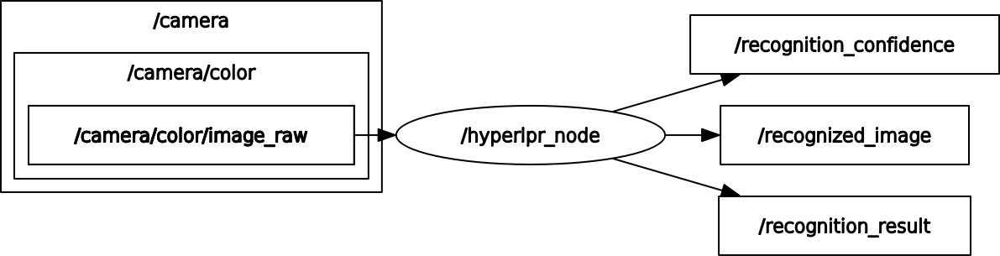

# Prj-ROS

HyperLPR的ROS包，封装了Prj-Linux的代码并为适配ROS进行了少量修改，在Ubuntu20.04中ros-noetic上进行了测试。

## 安装依赖

``` bash
sudo apt install ros-noetic-desktop-full
```
ros-noetic使用的opencv版本为opencv4，可能会与opencv3冲突，请注意停用opencv3以免无法编译运行

## 编译

本文件所在路径为catkin_ws，rospackage路径为 `/HyperLPR/Prj-ROS/src/hyperlpr`

``` bash
cd Prj-ROS
catkin build
echo "source ${PATH_TO_HYPERLPR}/Prj-ROS/devel/setup.bash" >> ~/.bashrc
```

进入`/Prj-ROS/src/hyperlpr/launch/bringup.launch`，修改`CameraTopic`为自己相机图像的topic

## 运行

``` bash
roslaunch hyperlpr bringup.launch
```

## 说明

与ros node有关的代码位于`/Prj-ROS/src/hyperlpr/src`中的`hyperlpr_node.h`和`hyperlpr_node.cpp`中，可以按需修改

运行时的rqt_graph如下



测试时使用的相机为Intel-RealSense D455，`bringup.launch`中默认CameraTopic为RealSense彩色图像topic

发布的三个topic分别为

+ /recognition_confidence 识别的置信度

+ /recognition_result 识别的结果，不过ROS不支持中文字符，所以在使用时需要对订阅的数据另作处理，想立即确定中文结果也可以查看terminal中ROS_INFO输出的结果

+ /recognized_image 框选出一帧所有可识别车牌的图像

以上三个topic均只对置信度大于75%的识别作出反应，可以调整代码中的置信度阈值以获得期待的识别效果
