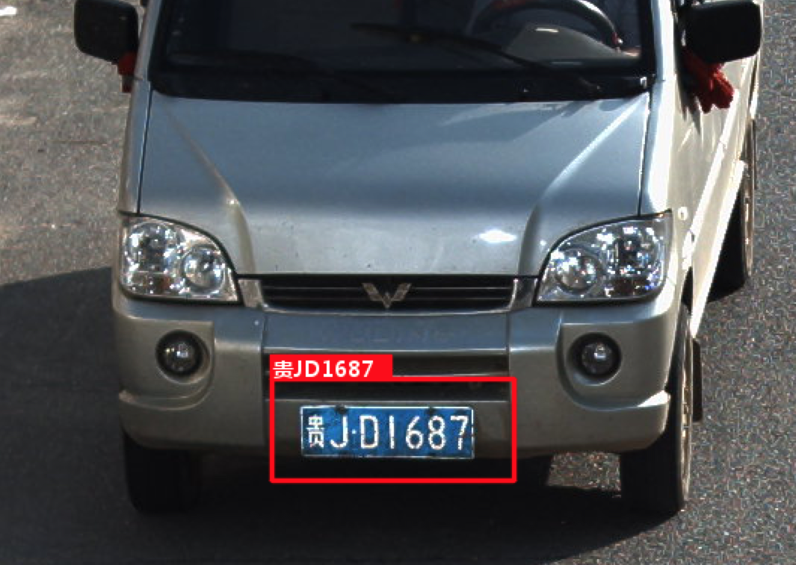
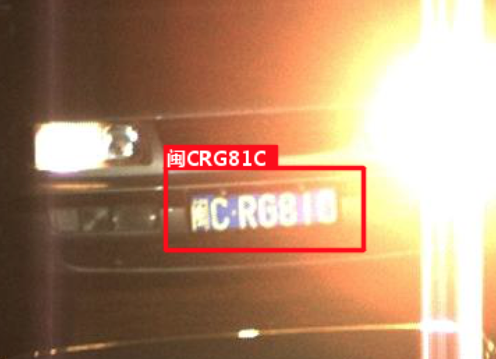

# 车牌识别

### 介绍

HyperLPR是一个基于Python的使用深度学习针对对中文车牌识别的实现，与开源的[EasyPR](https://github.com/liuruoze/EasyPR)相比，它的检测速度和鲁棒性和多场景的适应性都要好于EasyPR。


### 特性

+ 单张720p 识别时间在单核Intel 2.2G CPU(MBP2015 15inch)不低于 140ms。比EasyPR单核识别速度快近10倍左右的时间。
+ 识别率在EasyPR数据集上0-error达到70.2% 1-error识别率达到 89.6%
+ 单线程平均检测时间在EasyPR数据集在保持在160ms以下。基于adaboost检测方法在实时性、召回率、准确率上都不逊于MSER方法。检测recall和easyPR持平。
+ 代码框架轻量，总代码不到1k行。

### 依赖

+ Keras + Theano backend (Tensorflow data order)
+ Theano
+ Numpy
+ Scipy
+ OpenCV
+ scikit-image

### Pipeline

step1. 使用opencv 的 HAAR cascade 检测车牌大致位置 

step2. Extend 检测到的大致位置的矩形区域

step3. 使用类似于mser的方式的多级二值化+ransac拟合车牌的上下边界

step4. 使用CNN regression回归车牌左右边界

step5. 使用CNN滑动窗切割字符

step6. 使用CNN识别字符

### 简单使用方式

```python
from hyperlpr import  pipline as  pp
import cv2
image = cv2.imread("filename")
image,res  = pp.SimpleRecognizePlate(image)
```
### 测试样例




