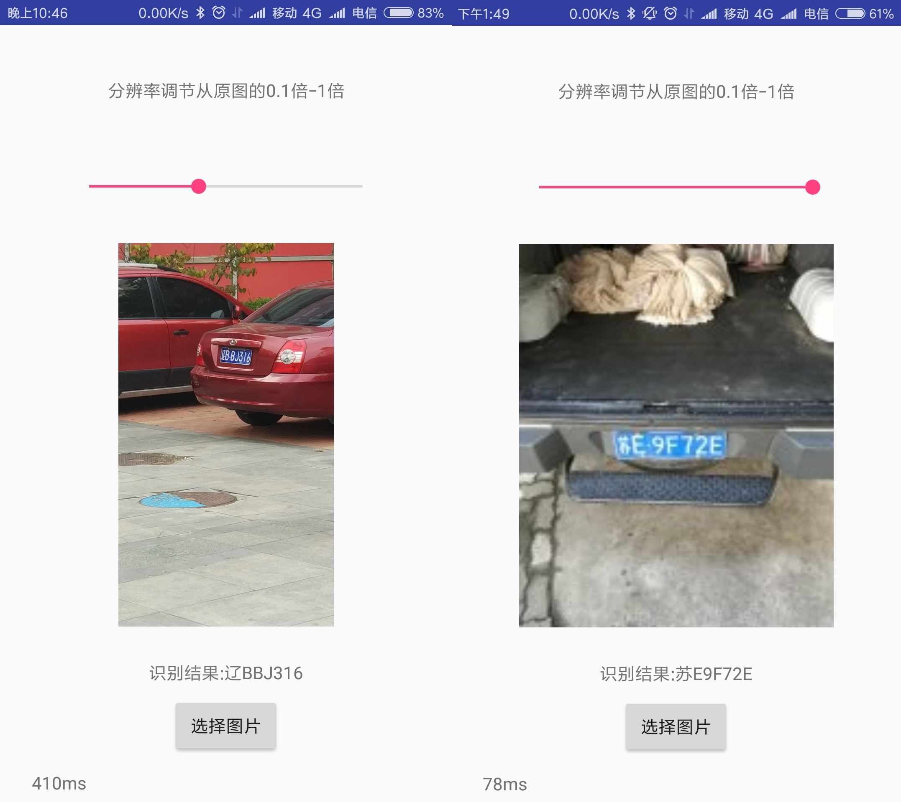

## HyperLPR   高性能开源中文车牌识别框架

#### [](https://pypi.org/project/hyperlpr/)[](https://pypi.org/project/hyperlpr/)

### 一键安装

`python -m pip install hyperlpr`

###### 支持python3,支持Windows  Mac Linux 树莓派等。

###### 720p cpu real-time (st on MBP r15 2.2GHz haswell).

#### 快速上手

```python
#导入包
from hyperlpr import *
#导入OpenCV库
import cv2
#读入图片
image = cv2.imread("demo.jpg")
#识别结果
print(HyperLPR_plate_recognition(image))
```

#### Q&A

Q：Android识别率没有所传demo apk的识别率高？

A：请使用[Prj-Linux](https://github.com/zeusees/HyperLPR/tree/master/Prj-Linux/lpr/model)下的模型，android默认包里的配置是相对较早的模型

Q：车牌的训练数据来源？

A：由于用于训练车牌数据涉及到法律隐私等问题，本项目无法提供。开放较为大的数据集有[CCPD](https://github.com/detectRecog/CCPD)车牌数据集。

Q：训练代码的提供？

A：相关资源中有提供训练代码

Q：关于项目的来源？

A：此项目来源于作者早期的研究和调试代码，代码缺少一定的规范，同时也欢迎PR。


#### 相关资源

- [Android配置教程](https://www.jianshu.com/p/94784c3bf2c1)
- [python配置教程](https://www.jianshu.com/p/7ab673abeaae)
- [Linux下C++配置教程](https://blog.csdn.net/lu_linux/article/details/88707421)
- [带UI界面的工程](https://pan.baidu.com/s/1cNWpK6)(感谢群内小伙伴的工作)。
- [端到端(多标签分类)训练代码](https://github.com/LCorleone/hyperlpr-train_e2e)(感谢群内小伙伴的工作)。
- [端到端(CTC)训练代码](https://github.com/armaab/hyperlpr-train)(感谢群内小伙伴工作)。

### 更新

- 更新了Android实现，增加实时扫描接口 (2019.07.24)
- 更新Windows版本的Visual Studio 2015 工程至端到端模型（2019.07.03）
- 更新基于端到端的IOS车牌识别工程。(2018.11.13)
- 可通过pip一键安装、更新的新的识别模型、倾斜车牌校正算法、定位算法。(2018.08.11)
- 提交新的端到端识别模型，进一步提高识别准确率(2018.08.03)
- [增加PHP车牌识别工程@coleflowers](https://github.com/zeusees/HyperLPR/tree/master/Prj-PHP) (2018.06.20)
- 添加了HyperLPR Lite 仅仅需160 行代码即可实现车牌识别(2018.3.12)
- 感谢 sundyCoder [Android 字符分割版本](https://github.com/sundyCoder/hyperlpr4Android) 
- 增加字符分割[训练代码和字符分割介绍](https://github.com/zeusees/HyperLPR-Training)(2018.1.)


### TODO

- 支持多种车牌以及双层
- 支持大角度车牌
- 轻量级识别模型

### 特性

- 速度快 720p,单核 Intel 2.2G CPU (MaBook Pro 2015)平均识别时间低于100ms
- 基于端到端的车牌识别无需进行字符分割
- 识别率高,卡口场景准确率在95%-97%左右
- 轻量,总代码量不超1k行

### 模型资源说明

- cascade.xml  检测模型 - 目前效果最好的cascade检测模型
- cascade_lbp.xml  召回率效果较好，但其错检太多
- char_chi_sim.h5 Keras模型-可识别34类数字和大写英文字  使用14W样本训练 
- char_rec.h5 Keras模型-可识别34类数字和大写英文字  使用7W样本训练 
- ocr_plate_all_w_rnn_2.h5 基于CNN的序列模型
- ocr_plate_all_gru.h5 基于GRU的序列模型从OCR模型修改，效果目前最好但速度较慢，需要20ms。
- plate_type.h5 用于车牌颜色判断的模型
- model12.h5 左右边界回归模型

### 注意事项:

- Win工程中若需要使用静态库，需单独编译
- 本项目的C++实现和Python实现无任何关联，都为单独实现
- 在编译C++工程的时候必须要使用OpenCV 3.3以上版本 (DNN 库)，否则无法编译 
- 安卓工程编译ndk尽量采用14b版本

### Python 依赖

- Keras (>2.0.0)
- Theano(>0.9) or Tensorflow(>1.1.x)
- Numpy (>1.10)
- Scipy (0.19.1)
- OpenCV(>3.0)
- Scikit-image (0.13.0)
- PIL

### CPP 依赖

- Opencv 3.4 以上版本

### Linux/Mac 编译

- 仅需要的依赖OpenCV 3.4 (需要DNN框架)

```bash
cd Prj-Linux
mkdir build 
cd build
cmake ../
sudo make -j 
```

### CPP demo

```cpp
#include "../include/Pipeline.h"
int main(){
    pr::PipelinePR prc("model/cascade.xml",
                      "model/HorizonalFinemapping.prototxt","model/HorizonalFinemapping.caffemodel",
                      "model/Segmentation.prototxt","model/Segmentation.caffemodel",
                      "model/CharacterRecognization.prototxt","model/CharacterRecognization.caffemodel",
                       "model/SegmenationFree-Inception.prototxt","model/SegmenationFree-Inception.caffemodel"
                    );
  //定义模型文件

    cv::Mat image = cv::imread("test.png");
    std::vector<pr::PlateInfo> res = prc.RunPiplineAsImage(image,pr::SEGMENTATION_FREE_METHOD);
  //使用端到端模型模型进行识别 识别结果将会保存在res里面
 
    for(auto st:res) {
        if(st.confidence>0.75) {
            std::cout << st.getPlateName() << " " << st.confidence << std::endl;
          //输出识别结果 、识别置信度
            cv::Rect region = st.getPlateRect();
          //获取车牌位置
 cv::rectangle(image,cv::Point(region.x,region.y),cv::Point(region.x+region.width,region.y+region.height),cv::Scalar(255,255,0),2);
          //画出车牌位置
          
        }
    }

    cv::imshow("image",image);
    cv::waitKey(0);
    return 0 ;
}
```

###  

### 可识别和待支持的车牌的类型

- [x] 单行蓝牌
- [x] 单行黄牌
- [x] 新能源车牌
- [x] 白色警用车牌
- [x] 使馆/港澳车牌
- [x] 教练车牌
- [ ] 武警车牌
- [ ] 民航车牌
- [x] 双层黄牌
- [ ] 双层武警
- [ ] 双层军牌
- [ ] 双层农用车牌
- [ ] 双层个性化车牌

###### Note:由于训练的时候样本存在一些不均衡的问题,一些特殊车牌存在一定识别率低下的问题，如(使馆/港澳车牌)，会在后续的版本进行改进。

### 测试样例


#### Android示例



### 识别测试APP

- 体验 Android APP：[http://demo.zeusee.com/HyperLPR](http://demo.zeusee.com/HyperLPR) (根据图片尺寸调整程序中的尺度，提高准确率)

#### 获取帮助

- HyperAI讨论QQ群: 529385694

### 作者和贡献者信息：

##### 作者昵称不分前后

- Jack Yu 作者(jack-yu-business@foxmail.com / https://github.com/szad670401)
- 肖潇 (xiaoxiao@xidian.edu.cn)
- AlanNewImage v2版win工程、python双层完善 (https://github.com/AlanNewImage)
- lsy17096535 整理(https://github.com/lsy17096535)
- xiaojun123456 IOS贡献(https://github.com/xiaojun123456)
- sundyCoder Android第三方贡献(https://github.com/sundyCoder)
- coleflowers php贡献(@coleflowers)
- Free&Easy 资源贡献 
- 海豚嘎嘎 LBP cascade检测器训练
- Windows工程端到端模型 (https://github.com/SalamanderEyes)
- Android实时扫描实现 (https://github.com/lxhAndSmh)
