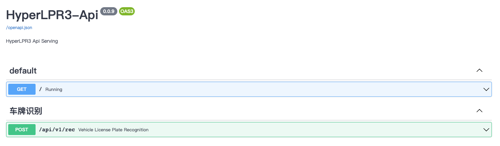
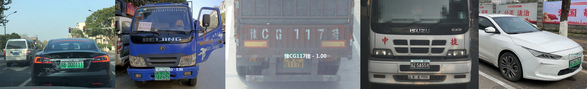

## HyperLPR3   高性能开源中文车牌识别框架

#### [](https://pypi.org/project/hyperlpr3/)[](https://pypi.org/manage/project/hyperlpr3/releases/)[](https://jitpack.io/#HyperInspire/hyperlpr3-android-sdk)


### 快速体验APP

- 体验 Android APP：[扫码下载](http://fir.tunm.top/hyperlpr)

### 一键安装

`python -m pip install hyperlpr3`

###### 支持python3, 支持Windows  Mac Linux 树莓派等。


###### 720p cpu real-time (st on MBP r15 2.2GHz haswell).

#### 快速体验

```bash
# 使用命令行测试 - 图像url地址
lpr3 sample -src https://koss.iyong.com/swift/v1/iyong_public/iyong_2596631159095872/image/20190221/1550713902741045679.jpg

# 使用命令行测试 - 本地图像路径
lpr3 sample -src images/test_img.jpg -det high
```

#### 快速上手

```python
# 导入opencv库
import cv2
# 导入依赖包
import hyperlpr3 as lpr3

# 实例化识别对象
catcher = lpr3.LicensePlateCatcher()
# 读取图片
image = cv2.imread("images/test_img.jpg")
# 识别结果
print(catcher(image))

``` 
#### 启动WebApi服务

```bash
# 启动服务
lpr3 rest --port 8715 --host 0.0.0.0
```
启动后可打开SwaggerUI的路径：[http://localhost:8715/api/v1/docs](http://localhost:8715/api/v1/docs) 查看和测试在线识别API服务:




#### Q&A

Q：Android识别率没有所传demo apk的识别率高？

A：请自行编译或从release中下载安卓动态库放置于Prj-Android中进行测试。

Q：车牌的训练数据来源？

A：由于用于训练车牌数据涉及到法律隐私等问题，本项目无法提供。开放较为大的数据集有[CCPD](https://github.com/detectRecog/CCPD)车牌数据集。

Q：训练代码的提供？

A：相关资源中有提供老版的训练代码，HyperLPR3的训练方法会陆续整理并给出。

Q：关于项目的来源？

A：此项目来源于作者早期的研究和调试代码，代码缺少一定的规范，同时也欢迎PR。


#### 相关资源

- [HyperLPR3车牌识别-五分钟搞定: 中文车牌识别光速部署与使用](https://blog.csdn.net/weixin_40193776/article/details/129258107)

- [HyperLPR3车牌识别-Android-SDK光速部署与使用](https://blog.csdn.net/weixin_40193776/article/details/129394240)

- [HyperLPR3车牌识别-Linux/MacOS使用：C/C++库编译](https://blog.csdn.net/weixin_40193776/article/details/129295679)

- [HyperLPR3车牌识别-Android使用：SDK编译与部署](https://blog.csdn.net/weixin_40193776/article/details/129354938)
- 待补充...欢迎投稿

#### 其他版本

- [HyperLPRv1版](https://github.com/szad670401/HyperLPR/tree/v1)

- [HyperLPRv2版](https://github.com/szad670401/HyperLPR/tree/v2)

### TODO

- 支持快速部署WebApi服务
- 支持多种车牌以及双层
- 支持大角度车牌
- 轻量级识别模型


### 特性

- 速度快 720p,单核 Intel 2.2G CPU (MaBook Pro 2015)平均识别时间低于100ms
- 基于端到端的车牌识别无需进行字符分割
- 识别率高,卡口场景准确率在95%-97%左右
- 支持跨平台编译和快速部署

### 注意事项:

- 本项目的C++实现和Python实现无任何关联，都为单独实现
- 在编译C++工程的时候必须要使用OpenCV 4.0和MNN 2.0以上版本，否则无法编译 
- 安卓工程编译ndk尽量采用21版本

### Python 依赖
- opencv-python (>3.3)
- onnxruntime (>1.8.1)
- fastapi (0.92.0)
- uvicorn (0.20.0)
- loguru (0.6.0)
- python-multipart
- tqdm
- requests 

### 跨平台支持

#### 平台
- Linux: x86、Armv7、Armv8
- MacOS: x86
- Android: arm64-v8a、armeabi-v7a
  
#### 开发板
- Rockchip: rv1109rv1126(RKNPU)

### CPP 依赖

- Opencv 4.0 以上版本
- MNN 2.0 以上版本

### C/C++编译依赖库

编译C/C++工程需要使用第三方依赖库，将库下载后解压，并将其通过拷贝或软链接放入根目录(与CMakeLists.txt同级)即可，依赖的库下载地址：[百度网盘](https://pan.baidu.com/s/1zfP2MSsG1jgxB_MjvpwZJQ) code: eu31

### Linux/Mac动态链接库编译

- 需要将依赖库放置或链接在项目根目录下(与CMakeLists.txt同级)

```bash
# 执行编译脚本
sh command/build_release_linux_share.sh

```
编译后的相关物料放置于根目录下**build/linux/install/hyperlpr3**中，其中包含：
- include 头文件
- lib 动态库路径
- resource 包含测试图片与模型等静态资源

按需取走需要的文件即可

### Linux/Mac编译Demo

- 需要完成上一步的编译动作，并保证编译成功且编译完成后的物料放置于根目录下的**build/linux/install/hyperlpr3**路径中
- 需要从根目录中进入到子工程**Prj-Linux**文件夹中进行操作
```bash
# 进入到子工程demo
cd Prj-Linux
# 执行编译脚本
sh build.sh
```
编译完成后生成可执行程序**PlateRecDemo**，执行运行测试
```bash
# 进入编译目录
cd build/
# 传入模型文件夹路径和需要预测的图像执行程序
./PlateRecDemo ../hyperlpr3/resource/models/r2_mobile ../hyperlpr3/resource/images/test_img.jpg
```
### Linux/Mac快速使用SDK代码示例
```C
// 读取图像
cv::Mat image = cv::imread(image_path);
// 创建ImageData
HLPR_ImageData data = {0};
data.data = image.ptr<uint8_t>(0);      // 设置图像数据流
data.width = image.cols;                   // 设置图像宽
data.height = image.rows;                  // 设置图像高
data.format = STREAM_BGR;                  // 设置当前图像编码格式
data.rotation = CAMERA_ROTATION_0;         // 设置当前图像转角
// 创建数据Buffer
P_HLPR_DataBuffer buffer = HLPR_CreateDataBuffer(&data);

// 配置车牌识别参数
HLPR_ContextConfiguration configuration = {0};
configuration.models_path = model_path;         // 模型文件夹路径
configuration.max_num = 5;                      // 最大识别车牌数量
configuration.det_level = DETECT_LEVEL_LOW;     // 检测器等级
configuration.use_half = false;
configuration.nms_threshold = 0.5f;             // 非极大值抑制置信度阈值
configuration.rec_confidence_threshold = 0.5f;  // 车牌号文本阈值
configuration.box_conf_threshold = 0.30f;       // 检测器阈值
configuration.threads = 1;
// 实例化车牌识别算法Context
P_HLPR_Context ctx = HLPR_CreateContext(&configuration);
// 查询实例化状态
HREESULT ret = HLPR_ContextQueryStatus(ctx);
if (ret != HResultCode::Ok) {
    printf("create error.\n");
    return -1;
}
HLPR_PlateResultList results = {0};
// 执行车牌识别算法
HLPR_ContextUpdateStream(ctx, buffer, &results);

for (int i = 0; i < results.plate_size; ++i) {
	// 解析识别后的数据
    std::string type;
    if (results.plates[i].type == HLPR_PlateType::PLATE_TYPE_UNKNOWN) {
        type = "未知";
    } else {
        type = TYPES[results.plates[i].type];
    }

    printf("<%d> %s, %s, %f\n", i + 1, type.c_str(),
           results.plates[i].code, results.plates[i].text_confidence);
}

// 销毁Buffer
HLPR_ReleaseDataBuffer(buffer);
// 销毁Context
HLPR_ReleaseContext(ctx);
```

### Android编译动态链接库
- 需要完成上面的步骤：安装第三方依赖库
- 需要提前下载NDK并配置环境变量：$ANDROID_NDK
- 支持在Linux/MacOS下进行交叉编译
```bash
# 执行编译脚本
sh command/build_release_android_share.sh
```
编译完成后android的动态库会放置于**build/release_android/**，其中包含：
- arm64-v8a 64位的动态库
- armeabi-v7a 32位的动态库

完成Android的动态库编译后，将**arm64-v8a**和**armeabi-v7a**文件夹放置于子项目路径**Prj-Android/hyperlpr3/libs**中，再编译android项目即可使用。**Prj-Android**项目中已内置hyperlpr3的SDK与使用demo。

### 使用Docker进行构建

如果你需要使用docker编译，我们提供了几种编译方法:

#### 1. 使用docker编译Linux-x86动态库

你需要提前安装好docker和docker-compose，并执行脚本构建**hyperlpr_build**的镜像:

```Bash
docker build -t hyperlpr_build .
```

开始编译动态库:

```Bash
docker-compose up build_linux_x86_shared_lib
```

编译目录: **build/linux**

### Android-SDK示例工程

我们提供了一个Android-SDK相关的Demo工程：[hyperlpr3-android-sdk](https://github.com/HyperInspire/hyperlpr3-android-sdk.git)，您可以根据需求去编译动态库使用该项目。

### 在Android中快速集成HyperLPR

如果你需要快速将我们的sdk集成到你自己的Android项目中，那么你可以将以下依赖添加到项目的build.gradle中:

- 步骤 1. 将JitPack仓库添加到构建文件中。将其添加到根构建中。在仓库末尾添加Gradle:

```Java
allprojects {
	repositories {
		...
		maven { url 'https://jitpack.io' }
	}
}
```

- 步骤 2. 添加以下依赖
```Java
dependencies {
	  implementation 'com.github.HyperInspire:hyperlpr3-android-sdk:1.0.3'
}
```

- 步骤 3. 在应用程序中使用hyperlpr

```Java
// 初始化通常在程序初始化时执行，只需执行一次
HyperLPR3.getInstance().init(this, new HyperLPRParameter());

…

// 识别一张图像
Plate[] plates =  HyperLPR3.getInstance().plateRecognition(bitmap, HyperLPR3.CAMERA_ROTATION_0, HyperLPR3.STREAM_BGRA);
```

关于快速集成到安卓工程可以查看: **[Prj-Android](./Prj-Android)**

### 可识别和待支持的车牌的类型(中文)

#### 支持
- [x] 单行蓝牌
- [x] 单行黄牌
- [x] 新能源车牌
- [x] 教练车牌
#### 有限支持
- [x] 白色警用车牌
- [x] 使馆/港澳车牌
- [x] 双层黄牌
- [x] 武警车牌
#### 待支持
- [ ] 民航车牌
- [ ] 双层武警
- [ ] 双层军牌
- [ ] 双层农用车牌
- [ ] 双层个性化车牌
- [ ] 更多国家车牌

###### Note:由于训练的时候样本存在一些不均衡的问题,一些特殊车牌存在一定识别率低下的问题，如(使馆/港澳车牌)，会在后续的版本进行改进。


### 效果示例




#### 获取帮助

- HyperInspire讨论QQ群: 529385694，加前请备注HyperLPR交流

